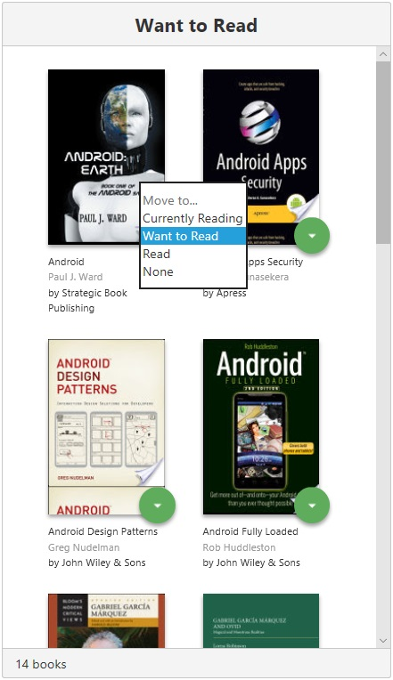

# MyReads
## Project Purpose

This app was built for the Udacity React Nanodegree Program. The purpose of the project is to demonstrate understanding of the basic structure and operation of a React-based app.

## How to Load the App
### Hosted version

You can run a responsive hosted version of the app at [milsonei-myreads.surge.sh/](https://milsonei-myreads.surge.sh/)

### Instalation
Once Node is installed, navigate to the directory where you want to store the app

```
git clone https://github.com/milsonei/reactnd-myreads.git
npm install
```

### Project
The project uses Node.js and the Create-React-App starter. If you do not have **Node >= 8.x** installed, you can download it here: [Node.js](https://nodejs.org/en/)

```bash
├── CONTRIBUTING.md
├── README.md - This file.
├── SEARCH_TERMS.md #The whitelisted short collection of available search terms for you to use with your app.
├── package.json #npm package manager file. It's unlikely that you'll need to modify this.
├── public
│   ├── favicon.ico #React Icon, You may change if you wish.
│   └── index.html #DO NOT MODIFY
└── src
    ├── components
    │   ├── App.js #This is the root of app. Contains static HTML right now.#
    │   ├── Book.js #This is a component responsible for rendering the cover page of the book and other information such as title, authors and cover.
    │   │            #This component presents two different types of behaviors. In the search screen result, if the book is already included in the user's shelf, 
    │   │            #small icon is shown in the upper right corner, but in home, this icon is hidden.
    │   ├── BookList.js #This is a component responsible for generating a book listing, thus rendering a collection based on the component Book.
    │   │                #This component is used by the BookSearch and BookShelf components.#
    │   ├── BooksAPI.js #A JavaScript API for the provided Udacity backend. Instructions for the methods are below.
    │   ├── BookSearch.js #is is a component responsible for generating a book listing based on the response sent by the BooksAPI javascript API.
    │   │                  #The book listing is managed by the BookList component.
    │   │                  #The chosen book will be placed on a shelf after the reader's action.
    │   ├── BookShelf.js  #This is a component responsible for generating a classified listing of books according to the type of shelf. 
    │   │                  #The types of shelf are: "Currently Reading", "Want to Read" and "Read".
    │   ├── BookShelfChanger.js #This is a component responsible for orchestrating the change of a particular book to another shelf, as well as permanently removing it from the reader's shelves.
    │   │                        #The request is cascaded for each parent component, until finally it is sent remotely by the responsible API.
    │   ├── Home.js #This is a component responsible for generating the home page of the application. It renders the VirtualBookcase component.
    │   ├── Search.js #This is a component responsible for generating the application's search page. It renders the BookSearch component.
    │   ├── VirtualBookcase.js #This is a component responsible for generating the reader's book page. 
    │   │                       #This page is responsive according to screen size, and for screens larger than 796px, the shelves are arranged in columns and on smaller screens, they are arranged in lines. 
    │   │                       #This feature is provided by the Row and Col components of the ANTD library.
    ├── css #Styles for app#
    │   ├── App.css
    ├── icons #Helpful icons for app.
    │   ├── add.svg
    │   ├── arrow-back.svg
    │   ├── arrow-drop-down.svg
    │   └── magnifying-glass-icon
    ├── images #Helpful images for app. 
    │   ├── screenshots
    │   │   ├── book-in-shelf.jpg
    │   │   ├── change-shelf.jpg 
    │   │   ├── choosing-book.jpg
    │   │   ├── home.jpg
    │   │   ├── notification.jpg
    │   │   ├── remove-confirmation-dialog.jpg
    │   │   └── search-book-result.jpg
    │   └── cover-image-not-available.png #Default image for books without cover
    ├── utils #utilities for app
    │   ├── BooksUtil.js #This class provides support functions for the entire application
    │   └── DialoUtil.js #This class provides functions that show notifications and dialogs from the ANTD library
    ├── App.test.js #Used for testing. Provided with Create React App.
    ├── index.css #Global styles. You probably won't need to change anything here.
    └── index.js #You should not need to modify this file. It is used for DOM rendering only.
```

### Main dependencies
```bash
 └── node_modules
      ├── antd (version >= 3.10.9) #Ant Design of React - React UI library antd that contains a set of high quality components and demos for building rich, interactive user interfaces. See more in https://ant.design/docs/react/introduce#Installation
      ├── lib
      │   ├── tooltip #A simple text popup tip. see more in https://ant.design/components/tooltip/
      │   ├── alert #Alert component for feedback. see more in https://ant.design/components/alert/
      │   ├── spin #A spinner for displaying loading state of a page or a section. see more in https://ant.design/components/spin/
      │   ├── grid #Grids System. see more https://ant.design/components/grid/
      │   │   ├──Col
      │   │   └── Row 
      │   ├── notification # Display a notification message globally.. see more in https://ant.design/components/notification/
      │   ├── icon #Semantic vector graphics. see more in https://ant.design/components/icon/
      │   └── modal #Modal dialogs. see more in https://ant.design/components/modal/
      ├── sort-by (version >= 1.2.0) #utility to create comparator functions for the native Array.sort() in both node and the browser.
                                      #Allows for sorting by multiple properties. see more in https://www.npmjs.com/package/sort-by
      └── prop-types (version >= 15.6.2) #Runtime type checking for React props and similar objects. see more in https://www.npmjs.com/package/prop-types
```

Once all of the dependencies have been installed you can launch the app with

```
npm start
```
A new browser window should automatically open displaying the app. If it doesn't, navigate to [http://localhost:3000/](http://localhost:3000/) in your browser


## How to Use the App

- Books are sorted into three categories: Currently Reading, Want to Read and Read
- The number of books on each shelf is shown in the footer
- To change a book's category or remove a book from the list, click on the green button on the book cover. 
  
- If you remove a book from the list, you'll need to confirm the action first.
  
- To add new books: 
  - Click on the green + button at the bottom of the page.
  - Enter an author's name or subject.
  - Press the return key or click the search button. 
  - Up to 20 items will be returned.

_Note: The backend API is limited to a fixed set of [search terms](#search-terms) -- see below for valid search options_


- For books that have already been chosen by the reader will be shown a tag icon in the upper right corner.


- To choose a book's from the search list, click on the green button on the book cover. 


- After the book is added to the target shelf, a notification message will be displayed stating the success or failure of the action.


## Backend Server

To simplify your development process, we've provided a backend server for you to develop against. The provided file [`BooksAPI.js`](src/BooksAPI.js) contains the methods you will need to perform necessary operations on the backend:

* [`getAll`](#getall)
* [`update`](#update)
* [`search`](#search)

### `getAll`

Method Signature:

```js
getAll()
```

* Returns a Promise which resolves to a JSON object containing a collection of book objects.
* This collection represents the books currently in the bookshelves in your app.

### `update`

Method Signature:

```js
update(book, shelf)
```

* book: `<Object>` containing at minimum an `id` attribute
* shelf: `<String>` contains one of ["wantToRead", "currentlyReading", "read"]  
* Returns a Promise which resolves to a JSON object containing the response data of the POST request

### `search`

Method Signature:

```js
search(query)
```

* query: `<String>`
* Returns a Promise which resolves to a JSON object containing a collection of a maximum of 20 book objects.
* These books do not know which shelf they are on. They are raw results only. You'll need to make sure that books have the correct state while on the search page.

## Resources and Documentation:

- [Create-react-app Documentation](https://github.com/facebookincubator/create-react-app)
- [React Router Documentation](http://knowbody.github.io/react-router-docs/)
- [React Training/React Router](https://reacttraining.com/react-router/web/api/BrowserRouter)
- [React API](https://facebook.github.io/react/docs/react-api.html)

## Udacity Resources:

- [Project starter template](https://github.com/udacity/reactnd-project-myreads-starter)
- [Project Rubric](https://review.udacity.com/#!/rubrics/918/view)
- [Udacity CSS Style Guide](http://udacity.github.io/frontend-nanodegree-styleguide/css.html)
- [Udacity HTML Style Guide](http://udacity.github.io/frontend-nanodegree-styleguide/index.html)
- [Udacity JavaScript Style Guide](http://udacity.github.io/frontend-nanodegree-styleguide/javascript.html)

#### Search Terms

'Android', 'Art', 'Artificial Intelligence', 'Astronomy', 'Austen', 'Baseball', 'Basketball', 'Bhagat', 'Biography', 'Brief', 'Business', 'Camus', 'Cervantes', 'Christie', 'Classics', 'Comics', 'Cook', 'Cricket', 'Cycling', 'Desai', 'Design', 'Development', 'Digital Marketing', 'Drama', 'Drawing', 'Dumas', 'Education', 'Everything', 'Fantasy', 'Film', 'Finance', 'First', 'Fitness', 'Football', 'Future', 'Games', 'Gandhi', 'History', 'History', 'Homer', 'Horror', 'Hugo', 'Ibsen', 'Journey', 'Kafka', 'King', 'Lahiri', 'Larsson', 'Learn', 'Literary Fiction', 'Make', 'Manage', 'Marquez', 'Money', 'Mystery', 'Negotiate', 'Painting', 'Philosophy', 'Photography', 'Poetry', 'Production', 'Program Javascript', 'Programming', 'React', 'Redux', 'River', 'Robotics', 'Rowling', 'Satire', 'Science Fiction', 'Shakespeare', 'Singh', 'Swimming', 'Tale', 'Thrun', 'Time', 'Tolstoy', 'Travel', 'Ultimate', 'Virtual Reality', 'Web Development', 'iOS'

_This project is licensed under the terms of the MIT license._
